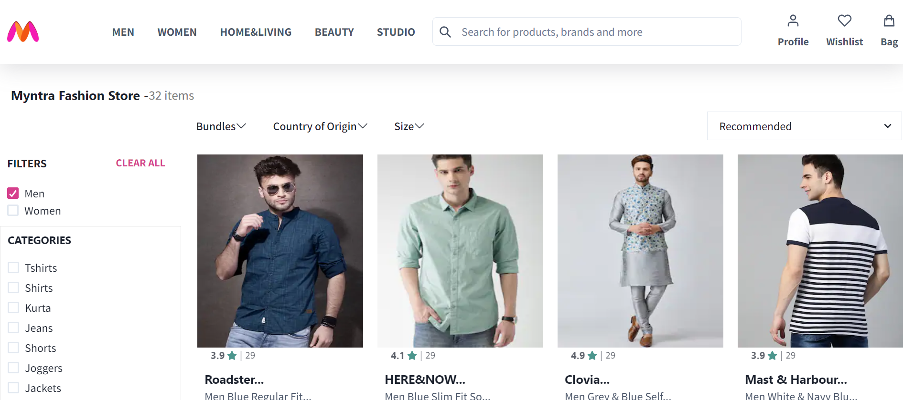

# Myntra Clone


A clone of the popular online fashion and lifestyle e-commerce platform, Myntra.com, built with React. This project is designed to showcase my skills in web development, particularly front-end technologies, and demonstrate my ability to recreate a complex web application like Myntra.

## Table of Contents

- [Demo](#demo)
- [Features](#features)
- [Technologies Used](#technologies-used)
- [Installation](#installation)
- [Screenshots](#screenshots)
- [Contributing](#contributing)
- [License](#license)

## Demo

[Link to Live Demo](https://myntra-clone-rho.vercel.app/)

Checkout the above live demo link to use the website.

## Features

- **User Authentication**: Register, log in, and manage user accounts with OTP verification.
- **Product Catalog**: Browse, search, and filter a wide range of fashion products.
- **Product Details**: View detailed information about each product, including images, prices, and descriptions.
- **Shopping Cart**: Add and remove items from the cart, calculate the total price.
- **Checkout Process**: Simulate the purchase process, including shipping and payment options.
- **Order History**: View previous orders and their status.
- **User Profiles**: Edit personal information and track order history.
- **Responsive Design**: Ensure the website looks great on various devices and screen sizes.

## Technologies Used

- Front-end:
  - React
  - HTML, CSS, JavaScript
- State Management (Redux, Context API)
- Routing (React Router)
- Authentication (Firebase Phone Authentication)
- Payment Gateway Integration (Razorpay payment portal)
- Responsive Design (Chakra UI)
- Version Control (Git, GitHub)
- Additional libraries and dependencies (JSON Server for data storage and backend)

## Installation

Step-by-step instructions for setting up the project locally. 

```bash
# Clone the repository
git clone https://github.com/ritesh22201/Myntra.com-clone.git

# Navigate to the project directory
cd myntra-clone

# Install dependencies
npm install

# Start the application
npm start
```

## Screenshots

### Landing Page


### Signup/Login Page


### Product Page



### Cart Page


### Wishlist Page


### Address Page


### Payment Page


### Orders Page


